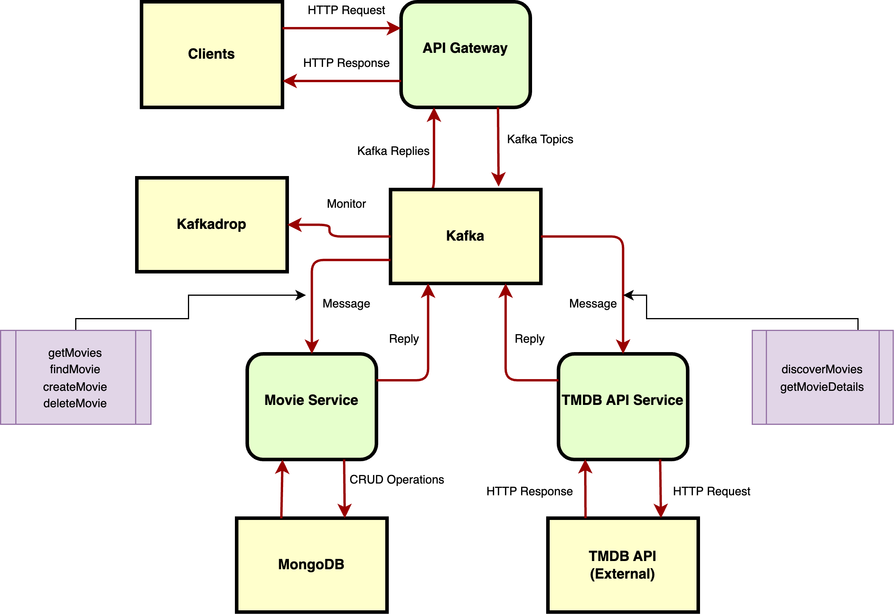

# TMDB NestJS Microservices Project

Welcome to the **TMDB NestJS Microservices Project**! This project is a microservices-based architecture built with [NestJS](https://nestjs.com/), leveraging GraphQL, MongoDB, and Apache Kafka. It consists of two microservices and an API Gateway, all orchestrated using Docker and Docker Compose.

## Table of Contents

- [Introduction](#introduction)
- [Architecture](#architecture)
- [Features](#features)
- [Technologies Used](#technologies-used)
- [Prerequisites](#prerequisites)
- [Getting Started](#getting-started)
  - [Clone the Repository](#clone-the-repository)
  - [Environment Variables](#environment-variables)
  - [Building the Services](#building-the-services)
  - [Running the Services](#running-the-services)
- [Services Overview](#services-overview)
  - [API Gateway](#api-gateway)
  - [Movie Service](#movie-service)
  - [TMDB API Service](#tmdb-api-service)
- [Inter-Service Communication](#inter-service-communication)
- [Docker Compose Setup](#docker-compose-setup)
- [Usage](#usage)
  - [Accessing the API Gateway](#accessing-the-api-gateway)
  - [Testing the Services](#testing-the-services)
- [Development](#development)
  - [Project Structure](#project-structure)
  - [Scripts](#scripts)
- [Troubleshooting](#troubleshooting)
- [License](#license)
- [Acknowledgments](#acknowledgments)

---

## Introduction

This project demonstrates a microservices architecture using NestJS, where each service is independently developed, deployed, and scaled. The services communicate with each other using Apache Kafka as the message broker and expose APIs via GraphQL and HTTP.

The project aims to provide a scalable and maintainable backend architecture suitable for modern applications that require high performance and flexibility.

---

## Architecture



- **API Gateway**: Serves as the single entry point for clients, handling authentication, authorization, and request routing to the appropriate microservices.
- **Movie Service**: Manages movie data, including CRUD operations and data persistence in MongoDB.
- **TMDB API Service**: Integrates with the [The Movie Database (TMDB)](https://www.themoviedb.org/documentation/api) API to fetch movie information and updates.

---

## Features

- **Microservices Architecture**: Independent services communicating via Apache Kafka.
- **GraphQL APIs**: Flexible and efficient data retrieval.
- **MongoDB Integration**: Data persistence using MongoDB.
- **Apache Kafka**: Robust message broker for inter-service communication.
- **Docker Compose**: Simplified deployment and orchestration.
- **Scalability**: Each service can be scaled independently.
- **Extensibility**: Easy to add new services or features.

---

## Technologies Used

- [NestJS](https://nestjs.com/): A progressive Node.js framework for building efficient and scalable server-side applications.
- [GraphQL](https://graphql.org/): A query language for APIs and a runtime for fulfilling those queries.
- [MongoDB](https://www.mongodb.com/): A NoSQL document-oriented database.
- [Apache Kafka](https://kafka.apache.org/): A distributed streaming platform.
- [Docker](https://www.docker.com/) & [Docker Compose](https://docs.docker.com/compose/): Containerization and orchestration tools.
- [TypeScript](https://www.typescriptlang.org/): Typed superset of JavaScript.
- [Yarn](https://yarnpkg.com/): Fast, reliable, and secure dependency management.

---

## Prerequisites

Ensure you have the following installed on your machine:

- [Docker](https://www.docker.com/get-started) (version 20.x or higher)
- [Docker Compose](https://docs.docker.com/compose/install/) (version 1.29 or higher)
- [Node.js](https://nodejs.org/en/download/) (version 16.x or higher)
- [Yarn](https://classic.yarnpkg.com/en/docs/install) (version 1.22.x)

---

## Getting Started

### Clone the Repository

```bash
git clone https://github.com/remidosol/tmdb-nestjs-microservices.git
cd tmdb-nestjs-microservices
```

### Environment Variables

Copy the `.env.example` file to `.env` and adjust the environment variables as needed in microservice folders.

```bash
cp .env.example .env
```

**Environment Variables in `.env`:**

```env
# MongoDB
DATABASE_URL="mongodb://mongodb:27017/tmdb"

# TMDB API
TMDB_API_KEY=your_tmdb_api_key
TMDB_READ_ACCESS_TOKEN=tmdb_read_access_token
```

### Building the Services

Build the Docker images for all services:

```bash
docker compose build
```

### Running the Services

Start all services using Docker Compose:

```bash
docker compose up -d
```

This command will start:

- **MongoDB**: Accessible on port `27018`.
- **Zookeeper**: Required by Kafka.
- **Kafka**: Message broker for inter-service communication.
- **Kafdrop**: Kafka web UI accessible on port `9000`.
- **Movie Service**: Runs on port `3001`.
- **TMDB API Service**: Runs on port `3002`.
- **API Gateway**: Runs on port `3000`.

---

## Services Overview

### API Gateway

- **Port**: `3000`
- **Description**: Acts as a single entry point into the system, routing requests to the appropriate microservices. Handles authentication, authorization, and aggregates data from multiple services.
- **APIs**:
  - **Swagger UI**: `/api/docs`
  - **RESTful API Endpoints**: Various endpoints for RESTful operations.
  - **GraphQL Endpoint**: `/graphql`
  - **RESTful API Endpoints**: `POST /csrf`, `GET /main_goal`, `GET or POST /movie`, `GET /movie/:id` `DELETE /movie/:id`

### Movie Service

- **Port**: `3001`
- **Description**: Provides CRUD operations for movie data. Stores movie information in MongoDB.

### TMDB API Service

- **Port**: `3002`
- **Description**: Integrates with the TMDB API to fetch and update movie information.

### Kafdrop

- **Port**: `9000`
- **Description**: A web UI for monitoring Kafka topics and messages.
- **Access**: `http://localhost:9000`

---

---

## Inter-Service Communication

Inter-service communication in this project is handled via **Apache Kafka**, which serves as the message broker facilitating asynchronous communication between microservices. The services publish and subscribe to specific message patterns (topics) to perform actions and exchange data.

### **Message Patterns and Topics**

#### **Movie Service**

The **Movie Service** listens for the following message patterns:

- **`getMovies`**: Retrieve a list of movies from the database.
- **`findMovie`**: Retrieve details of a specific movie by ID.
- **`createMovie`**: Add a new movie to the database.
- **`deleteMovie`**: Remove a movie from the database by ID.

#### **TMDB API Service**

The **TMDB API Service** listens for the following message patterns:

- **`discoverMovies`**: Fetch a list of movies from the TMDB API.
- **`getMovieDetails`**: Fetch detailed information about a specific movie from the TMDB API.

### **Communication Flow**

1. **API Gateway to Movie Service**

   - When the API Gateway receives a request related to movie data (e.g., fetching movies, creating a movie), it publishes a message to the appropriate topic (e.g., `getMovies`, `createMovie`).
   - The Movie Service, subscribed to these topics, processes the message and performs the required database operations.
   - If a response is needed, the Movie Service sends a reply message back to the API Gateway.

2. **API Gateway to TMDB API Service**

   - For requests requiring external data from TMDB, the API Gateway publishes messages to the `discoverMovies` or `getMovieDetails` topics.
   - The TMDB API Service handles these messages, interacts with the TMDB API, and sends the data back to the API Gateway.

### **Kafka Topics and Message Patterns**

Here's a summary of how topics and message patterns are used:

- **Topics**: In Kafka, topics are used to categorize messages. Each message pattern corresponds to a topic.
- **Message Patterns**:

  - **`getMovies`**
    - **Publisher**: API Gateway
    - **Subscriber**: Movie Service
    - **Description**: Request to retrieve a list of movies from the Movie Service.

  - **`findMovie`**
    - **Publisher**: API Gateway
    - **Subscriber**: Movie Service
    - **Description**: Request to retrieve a specific movie by ID.

  - **`createMovie`**
    - **Publisher**: API Gateway or TMDB API Service
    - **Subscriber**: Movie Service
    - **Description**: Request to add a new movie to the database.

  - **`deleteMovie`**
    - **Publisher**: API Gateway
    - **Subscriber**: Movie Service
    - **Description**: Request to delete a movie by ID.

  - **`discoverMovies`**
    - **Publisher**: API Gateway
    - **Subscriber**: TMDB API Service
    - **Description**: Request to fetch a list of movies from the TMDB API.

  - **`getMovieDetails`**
    - **Publisher**: API Gateway
    - **Subscriber**: TMDB API Service
    - **Description**: Request to fetch detailed information about a specific movie from the TMDB API.

#### **Kafdrop**

- **Purpose**: Kafdrop is integrated into the project to monitor Kafka topics and messages.
- **Features**:
  - View available topics and partitions.
  - Inspect messages flowing through each topic.
  - Monitor consumer groups and their offsets.

### **Example Communication Scenarios**

#### **Fetching Movies from the Database**

1. **Client Request**: A client sends a GET request to the API Gateway to fetch movies.
2. **API Gateway**:
   - Publishes a `getMovies` message to Kafka.
   - Awaits the response from the Movie Service.
3. **Movie Service**:
   - Subscribed to the `getMovies` topic.
   - Processes the request by fetching movies from MongoDB.
   - Sends a response back to the API Gateway.
4. **API Gateway**:
   - Receives the response.
   - Sends the data back to the client.

#### **Fetching Movies from TMDB API**

1. **Client Request**: A client wants to discover new movies from TMDB and sends a request to the API Gateway.
2. **API Gateway**:
   - Publishes a `discoverMovies` message to Kafka.
   - Awaits the response from the TMDB API Service.
3. **TMDB API Service**:
   - Subscribed to the `discoverMovies` topic.
   - Calls the TMDB API to fetch movie data.
   - Sends the data back to the API Gateway.
4. **API Gateway**:
   - Receives the response.
   - Sends the data back to the client.

#### **Creating a New Movie**

1. **Client Request**: A client sends a POST request to the API Gateway to create a new movie.
2. **API Gateway**:
   - Publishes a `createMovie` message with the movie data to Kafka.
   - Awaits the response from the Movie Service.
3. **Movie Service**:
   - Subscribed to the `createMovie` topic.
   - Processes the request by saving the movie data to MongoDB.
   - Sends a response back to the API Gateway.
4. **API Gateway**:
   - Receives the response.
   - Sends the confirmation back to the client.

### **Benefits of Using Kafka for Communication**

- **Asynchronous Processing**: Allows services to process requests independently without blocking.
- **Scalability**: Each service can scale horizontally without tight coupling.
- **Reliability**: Kafka ensures message delivery even if some services are temporarily unavailable.
- **Flexibility**: Easy to add new services or message patterns as the application grows.

### **Monitoring and Debugging**

- **Kafdrop**: Use Kafdrop to monitor the messages being published and consumed. This can help in debugging issues related to inter-service communication.
- **Logging**: Each service logs its activities. Ensure that logging is appropriately configured to capture essential information.

---

## Docker Compose Setup

The `docker-compose.yml` file defines all the services and their configurations. Key points include:

- **Networks**: All services are connected via the `tmdb-network`.
- **Volumes**: Persistent volumes for MongoDB data and node modules.
- **Environment Variables**: Passed to containers via the `environment` or `env_file` directives.
- **Depends On**: Ensures services start in the correct order.
- **Kafdrop Integration**: Added as a service to monitor Kafka.

**Docker Compose Services:**

```yaml
services:
  mongodb:
    # MongoDB service configuration

  zookeeper:
    # Zookeeper service configuration

  kafka:
    # Kafka service configuration

  kafdrop:
    # Kafdrop service configuration

  movie_service:
    # Movie Service configuration

  tmdb_api_service:
    # TMDB API Service configuration

  api_gateway:
    # API Gateway configuration
```

---

## Usage

### Accessing the API Gateway

The API Gateway provides both RESTful APIs and GraphQL endpoints, along with Swagger UI for API documentation.

#### Swagger UI

- **URL**: `http://localhost:3000/api/docs`
- **Description**: Access the Swagger UI to explore and test the RESTful API endpoints.

#### Available API Endpoints

Below is a summary of the main API endpoints exposed by the API Gateway:

- **CSRF Token Endpoint**

  - **URL**: `/api/csrf`
  - **Method**: `POST`
  - **Description**: Retrieves a CSRF token. Used for securing state-changing operations.

- **Main Goal Endpoint**

  - **URL**: `/api/main_goal`
  - **Method**: `GET`
  - **Description**: Provides the main goal or introductory data.

- **Movie Endpoints**

  - **Get All Movies**

    - **URL**: `/api/movie`
    - **Method**: `GET`
    - **Description**: Retrieves a list of movies.
    - **Query Parameters**:
      - `orderBy[field]`: Field to order by (e.g., `name`, `id`).
      - `orderBy[order]`: Order direction (`asc`, `desc`).

  - **Create a New Movie**

    - **URL**: `/api/movie`
    - **Method**: `POST`
    - **Description**: Creates a new movie.
    - **Request Body**:

      ```json
      {
        "id": "55",
        "name": "The Godfather",
        "overview": "Overview of the movie.",
        "popularity": 73.545,
        "voteAverage": 8.4,
        "voteCount": 1500,
        "releaseDate": "1972-03-14",
        "genres": [
          {
            "id": 1,
            "name": "Crime"
          },
          {
            "id": 2,
            "name": "Drama"
          }
        ]
      }
      ```

  - **Get a Movie by ID**

    - **URL**: `/api/movie/{movieId}`
    - **Method**: `GET`
    - **Description**: Retrieves a movie by its ID.
    - **Path Parameters**:
      - `movieId`: The ID of the movie.

  - **Delete a Movie**

    - **URL**: `/api/movie/{movieId}`
    - **Method**: `DELETE`
    - **Description**: Deletes a movie by its ID.
    - **Path Parameters**:
      - `movieId`: The ID of the movie.

- **Security Requirements**

  - **CSRF Protection**: The API uses CSRF tokens to protect state-changing operations.
    - **Cookie**: `__csrf`
    - **Header**: `x-tmdb-nestjs-csrf`

#### GraphQL Endpoint

- **URL**: `http://localhost:3000/graphql`
- **Description**: Access the GraphQL playground to interact with the API Gateway's GraphQL API.

---

### Accessing Kafdrop

Kafdrop is accessible at `http://localhost:9000`. You can use it to:

- View Kafka brokers.
- List topics and partitions.
- View messages in topics.
- Monitor consumer groups.

### Testing the Services

#### Example RESTful API Requests

- **Get All Movies**

  ```bash
  GET http://localhost:3000/api/movie
  ```

- **Create a New Movie**

  ```bash
  POST http://localhost:3000/api/movie
  Content-Type: application/json
  x-tmdb-nestjs-csrf: your_csrf_token

  {
    "id": "55",
    "name": "The Godfather",
    "overview": "Overview of the movie.",
    "popularity": 73.545,
    "voteAverage": 8.4,
    "voteCount": 1500,
    "releaseDate": "1972-03-14",
    "genres": [
      {
        "id": 1,
        "name": "Crime"
      },
      {
        "id": 2,
        "name": "Drama"
      }
    ]
  }
  ```

- **Get a Movie by ID**

  ```bash
  GET http://localhost:3000/api/movie/55
  ```

- **Delete a Movie**

  ```bash
  DELETE http://localhost:3000/api/movie/55
  x-tmdb-nestjs-csrf: your_csrf_token
  ```

#### Example GraphQL Query

```graphql
query {
  findMovie(id: "55") {
    id
    name
    overview
    releaseDate
    genres {
      id
      name
    }
  }
}
```

---

## Development

### Project Structure

```
tmdb-nestjs-microservices/
├── api-gateway/
│   ├── src/
│   ├── Dockerfile
│   ├── package.json
│   └── ...
├── movie-service/
│   ├── src/
│   ├── Dockerfile
│   ├── package.json
│   └── ...
├── tmdb-api-service/
│   ├── src/
│   ├── Dockerfile
│   ├── package.json
│   └── ...
└── docker-compose.yml
```

### Scripts

Each service has the following scripts defined in its `package.json`:

- **`start`**: Runs the service in production mode.
- **`start:dev`**: Runs the service in development mode with hot reloading.
- **`build`**: Compiles the TypeScript code.
- **`format`**: Runs the formatter (Prettier).
- **`lint`**: Runs the linter (ESLint).
- **`test`**: Runs the test suite.

---

## Troubleshooting

- **Containers Not Starting**: Check the Docker logs for errors.

  ```bash
  docker logs <container_name>
  ```

- **Port Conflicts**: Ensure no other services are running on the ports used by the project.

- **Kafka Connection Issues**: Verify that Kafka and Zookeeper are running and accessible. Use Kafdrop to monitor the Kafka cluster.

- **Environment Variables**: Double-check that all required environment variables are set correctly.

- **Swagger UI Not Accessible**: Ensure that the API Gateway is running and the Swagger module is correctly configured.

## License

This project is licensed under the [MIT License](./LICENSE).

## Acknowledgments

- [NestJS Documentation](https://docs.nestjs.com/)
- [GraphQL Documentation](https://graphql.org/learn/)
- [RESTful API Design](https://restfulapi.net/)
- [Swagger/OpenAPI Documentation](https://swagger.io/docs/)
- [MongoDB Documentation](https://docs.mongodb.com/)
- [Apache Kafka Documentation](https://kafka.apache.org/documentation/)
- [Kafdrop Documentation](https://github.com/obsidiandynamics/kafdrop)
- [Docker Documentation](https://docs.docker.com/)
